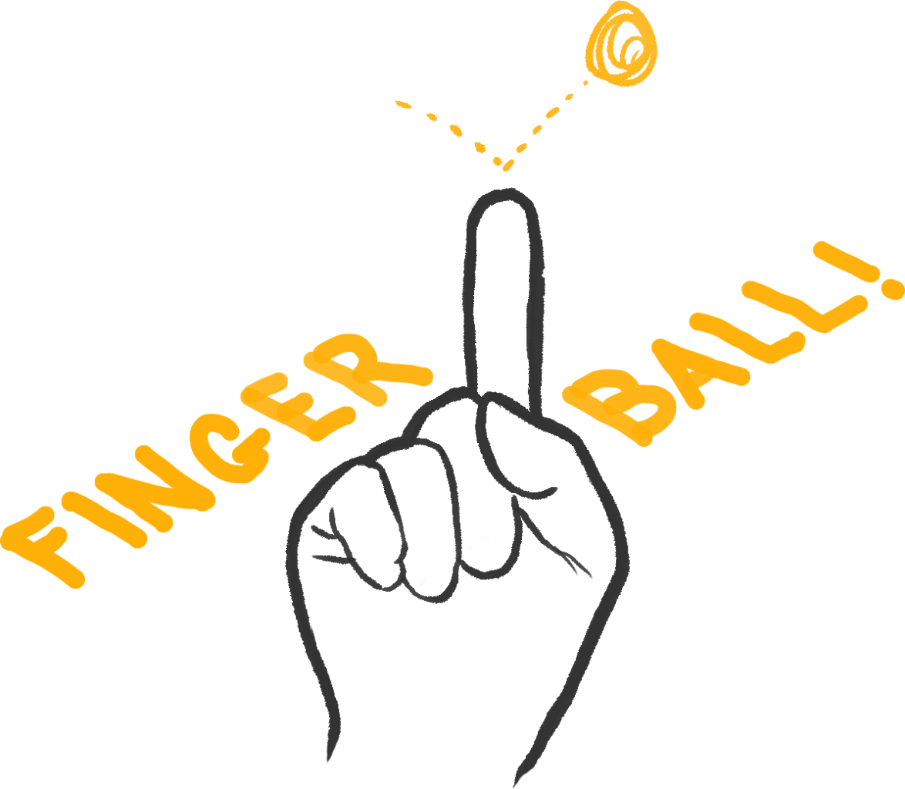

# Fingerball

Fingerball is a ball bouncing game that you control with your index finger.
[Play the Game!](https://laffan.github.io/fingerball/)
## Installation
`npm install`

## Development
`npm run dev`

## Deployment
Builds built to a gh-pages branch and hosted on GitHub Pages. A deployment script `deploy.sh` is provided to assist with this task.

## Credits / Thanks
- [Eliran Elnasi](https://eliraneln.medium.com/real-time-object-detection-using-ml5-js-and-react-c47612c60852) showed Nate how to connect [ml5.js](https://ml5js.org/) and [React Three Fiber](https://docs.pmnd.rs/).
- [Alvan Caleb Arulandu](https://www.youtube.com/watch?v=2kTQZVzkXgI&ab_channel=AlvanCalebArulandu) taught Nate about vertex buffers in React as well as the `needsUpdate` attribute in useRef() which he is eternally grateful for.
- [Bruno Simon](https://threejs-journey.com/)'s Three.js Journey course taught Samir how to use [Rapier](https://rapier.rs/), a physics engine, with react-three-fiber.
- StackOverflow users [rubenpoppe](https://stackoverflow.com/a/67694981) and [ulou](https://stackoverflow.com/a/67744487) showed Nate a clever way to parse `navigator.mediaDevices.getUserMedia()`.